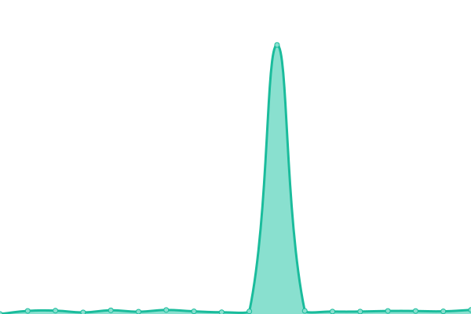
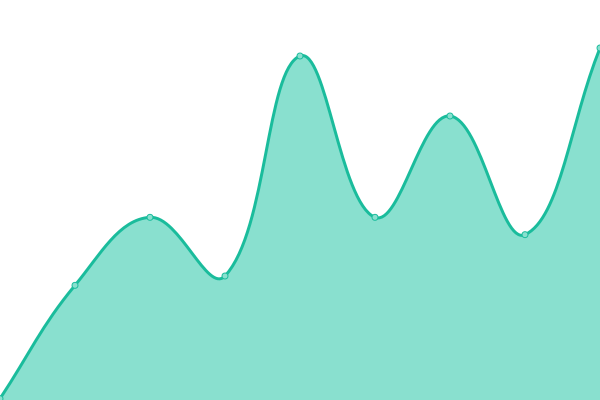
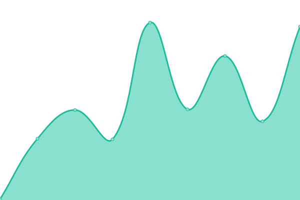
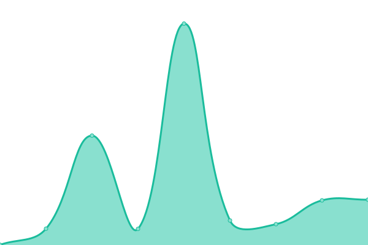

# [📈 Live Status](https://status.ops.neta.mx): <!--live status--> **🟩 All systems operational**

This repository contains the open-source uptime monitor and status page for [Upptime](https://upptime.js.org), powered by [Upptime](https://github.com/upptime/upptime).

With [Upptime](https://upptime.js.org), you can get your own unlimited and free uptime monitor and status page, powered entirely by a GitHub repository. We use [Issues](https://github.com/NetaMx/upptime/issues) as incident reports, [Actions](https://github.com/NetaMx/upptime/actions) as uptime monitors, and [Pages](https://status.ops.neta.mx) for the status page.

<!--start: status pages-->
<!-- This summary is generated by Upptime (https://github.com/upptime/upptime) -->
<!-- Do not edit this manually, your changes will be overwritten -->
<!-- prettier-ignore -->
| URL | Status | History | Response Time | Uptime |
| --- | ------ | ------- | ------------- | ------ |
|  NetaMx Site | 🟩 Up | [neta-mx-site.yml](https://github.com/NetaMx/upptime/commits/HEAD/history/neta-mx-site.yml) | 

 72ms
     
 | 

<a href="https://status.ops.neta.mx/history/neta-mx-site">99.82%</a>
    

|  Mi Tienda | 🟩 Up | [mi-tienda.yml](https://github.com/NetaMx/upptime/commits/HEAD/history/mi-tienda.yml) | 

 200ms
     
 | 

<a href="https://status.ops.neta.mx/history/mi-tienda">100.00%</a>
    

|  Data Analitycs | 🟩 Up | [data-analitycs.yml](https://github.com/NetaMx/upptime/commits/HEAD/history/data-analitycs.yml) | 

 256ms
     
 | 

<a href="https://status.ops.neta.mx/history/data-analitycs">98.78%</a>
    

|  Autenticacion | 🟩 Up | [autenticacion.yml](https://github.com/NetaMx/upptime/commits/HEAD/history/autenticacion.yml) | 

 188ms
     
 | 

<a href="https://status.ops.neta.mx/history/autenticacion">100.00%</a>
    

|  Facturacion | 🟩 Up | [facturacion.yml](https://github.com/NetaMx/upptime/commits/HEAD/history/facturacion.yml) | 

 120ms
     
 | 

<a href="https://status.ops.neta.mx/history/facturacion">100.00%</a>
    

|  Entregas | 🟩 Up | [entregas.yml](https://github.com/NetaMx/upptime/commits/HEAD/history/entregas.yml) | 

 120ms
     
 | 

<a href="https://status.ops.neta.mx/history/entregas">100.00%</a>
    

|  Ordenes | 🟩 Up | [ordenes.yml](https://github.com/NetaMx/upptime/commits/HEAD/history/ordenes.yml) | 

 118ms
     
 | 

<a href="https://status.ops.neta.mx/history/ordenes">100.00%</a>
    

|  Ordenes V2 | 🟩 Up | [ordenes-v2.yml](https://github.com/NetaMx/upptime/commits/HEAD/history/ordenes-v2.yml) | 

 119ms
     
 | 

<a href="https://status.ops.neta.mx/history/ordenes-v2">100.00%</a>
    

|  Gestion de Tiendas | 🟩 Up | [gestion-de-tiendas.yml](https://github.com/NetaMx/upptime/commits/HEAD/history/gestion-de-tiendas.yml) | 

 120ms
     
 | 

<a href="https://status.ops.neta.mx/history/gestion-de-tiendas">100.00%</a>
    

|  Core api | 🟩 Up | [core-api.yml](https://github.com/NetaMx/upptime/commits/HEAD/history/core-api.yml) | 

 216ms
     
 | 

<a href="https://status.ops.neta.mx/history/core-api">100.00%</a>
    

<!--end: status pages-->

[**Visit our status website →**](https://status.ops.neta.mx)

## 📄 License

- Powered by: [Upptime](https://github.com/upptime/upptime)
- Code: [MIT](./LICENSE) © [Upptime](https://neta.mx)
- Data in the `./history` directory: [Open Database License](https://opendatacommons.org/licenses/odbl/1-0/)
